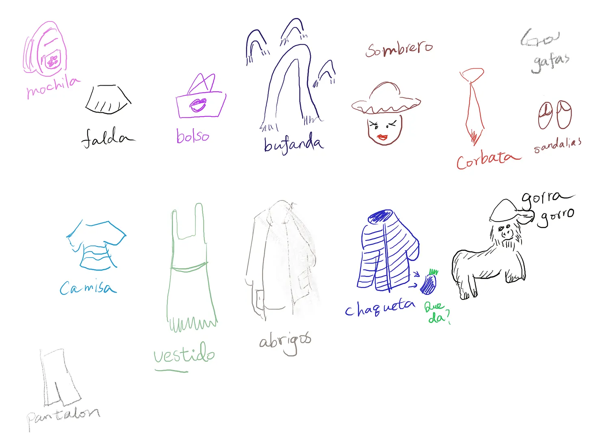
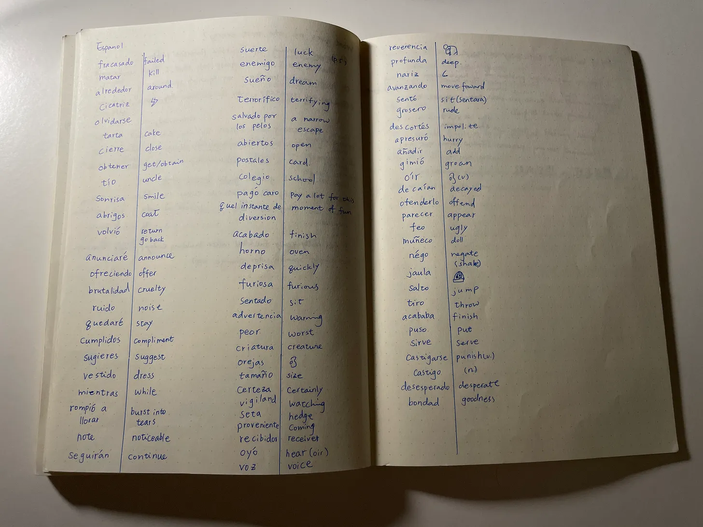

# AI Spanish Flashcard AI Generator
This is a tool where you can insert new Spanish vocabulary, and it will automatically generate a flashcard with an AI-generated image corresponding to the vocabulary for you.

## Background 
As I was reading Fluent Forever: How to Learn Any Language Fast and Never Forget It, I was reminded of a simple vocabulary memorizing method: Don’t use translation! Use images!

## My old method
Yes, I did the image method before for Spanish clothing. Images are so much more fun than looking at boring translation words, but…

Creating all these images took so much time, and lazy Esther ended up doing the translation method.

Nowadays, since AI can do lots of artwork, I started to imagine, can lazy Esther just ask AI to create the drawing part for her?
## My idea
This is my idea sketch. There are three simple ideas that come up to my mind.

1. Memory gallery: Whenever I input new vocab, AI will generate an image and store it in a flashcard library.

2. Matching Game: I can play a drag-and-drop matching game for the vocabulary in the memory gallery to review. (Note: But the most powerful memorizing method is still “recall” aka you look at the image and actively think of the word from your brain)

3. Practice with AI: I look like the photo, and try to describe the image with the vocabulary that I learn.

## Solution: Memory gallery
After seeing the possibility, I built a quick prototype for the memory gallery I was imagining.

## Next question
“Learn a word” for me means that I can easily apply it verbally in the sentence. Now, I can recognize the word, but how can I get to that application stage? What are the traditional methods that are effective? Can I use AI to practice with me?

